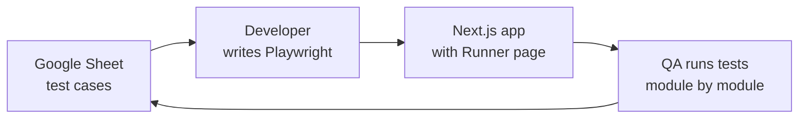

# How our E2E process works

A simple guide for developers and QA.

---

## The big picture

We keep test cases in a **Google Sheet**.  
Developers turn those cases into **Playwright** tests.  
QA runs those tests from a **web page (the Runner)** — no need to use the terminal.



After a run, results can go back to the sheet (Passed / Failed + comment).

---

## Who does what

| Role | Responsibility |
|------|----------------|
| **Developer** | Connects to the sheet, writes/updates Playwright tests, keeps the Runner working in the app |
| **QA** | Opens the Runner page, picks modules or cases, clicks Run, checks status and comments |

QA does **not** need to write Playwright. Developers own the automation; QA owns running and reviewing results.

---

## Step-by-step flow

### 1. Test cases live in Google Sheets

Each feature (Sign In, Projects, Apply Leave, …) has a tab with columns like:

- Test Case ID  
- Test Case (description)  
- Steps / data / expected result  
- Category (UI vs API)  
- UI Status / Playwright / Comment  

**UI cases** are for Playwright. **API cases** are not run in the Runner.

### 2. Developer connects the sheet in Cursor

The developer links **Google Sheets MCP** to the spreadsheet for that project.  
That lets Cursor read the sheet while generating or updating tests.

### 3. Developer generates Playwright tests

From the sheet rows (non-API only), the developer creates Playwright scripts that:

- Follow the sheet’s test IDs and titles  
- Use the sheet’s test data and expected results  
- Assert what the user actually sees in the browser  

These scripts live in the app (for example under `playwright-tests/`).

### 4. QA uses the Runner page

The app includes a page (usually `/e2e-runner`) where QA can:

- Choose a **module** (sheet tab / feature)  
- See which cases are implemented  
- See **UI Status**, **Playwright**, and **Comment** from the sheet  
- Run one case, several cases, or a whole module  
- Watch the run log  
- Optionally sync results back to the sheet  

That is the day-to-day QA experience.

---

## What we built (story so far)

### First: Runner inside one product (Ops4)

We needed a way for QA to run Playwright **by module**, with statuses visible next to the sheet cases — not only via command line.

So we built a **Runner** inside the Ops4 Next.js app:

- Lists cases from the sheet + local Playwright files  
- Runs them module-wise  
- Shows pass/fail and comments  

### Then: A reusable package

Setting up that Runner in every new project by hand was slow (pages, APIs, config, sheet sync, etc.).

So we moved the Runner into a shared package:

**`@6sense/sheet-e2e`**

Any Next.js app can install it and get the same Runner experience with much less setup.

```mermaid
flowchart TB
  subgraph before [Before]
    A1[Copy Runner code<br/>into each project]
  end
  subgraph after [Now]
    P[@6sense/sheet-e2e package]
    P --> App1[Project A]
    P --> App2[Project B]
    P --> App3[Project C]
  end
```

---

## How to use the package (developers)

### Add the Runner to a Next.js app

```bash
npm i -D github:hasib6sense/sheet-e2e#main
npx sheet-e2e init
npx sheet-e2e doctor
```

`init` wires the Runner page, APIs, scripts, and common config.  
You still need to:

1. Put the spreadsheet ID and Google credentials in `.env`  
2. Share the spreadsheet with the service account  
3. Map sheet tabs → Playwright files in `e2e/tab-suites.json`  
   (use the **exact** tab names from the sheet, e.g. `Apply_Leave`)  
4. Adjust login setup if the app needs signed-in tests  
5. Write or update Playwright specs from the sheet  

### Remove the Runner from a project

```bash
npx sheet-e2e uninstall -y
```

This removes Runner files and config patches. Playwright specs can stay.

### Day-to-day for developers

- Keep Playwright tests in sync with the sheet  
- Keep `tab-suites.json` accurate  
- Fix failures QA reports from the Runner  
- Improve selectors / stability when tests flake  

More detail (install flags, env vars): see the package [README](../README.md).

---

## How to use the Runner (QA)

1. Ask the developer for the Runner URL (often `http://localhost:3000/e2e-runner` in local/dev).  
2. Select the **module** you care about (e.g. Sign In).  
3. Check the list: case titles and sheet statuses should appear.  
4. Run one test, selected tests, or the module.  
5. Read the log if something fails.  
6. Confirm the sheet (or the Status / Comment columns on the page) after sync.

If Status shows only “—” and titles look like `TC_001` instead of a real sentence, tell the developer — usually the sheet tab name in config does not match the spreadsheet, or credentials are missing.

---

## End-to-end checklist

**Developer – first time on a project**

- [ ] Sheet exists with UI test cases  
- [ ] Google Sheets MCP connected in Cursor  
- [ ] Package installed + `init` + `doctor`  
- [ ] Credentials and spreadsheet ID set  
- [ ] Tabs mapped in `tab-suites.json`  
- [ ] Playwright specs written for UI cases  
- [ ] Runner page opens and shows statuses  

**QA – each cycle**

- [ ] Open Runner  
- [ ] Pick module  
- [ ] Run tests  
- [ ] Review pass/fail and comments  
- [ ] Report gaps to developers  

---

## Short summary

| Piece | Purpose |
|-------|---------|
| **Google Sheet** | Source of truth for test cases and statuses |
| **Playwright** | Automated browser tests (owned by developers) |
| **Runner page** | Simple UI so QA can run tests by module |
| **`@6sense/sheet-e2e` package** | Same Runner, easy to add to any Next.js project |

We started with a Runner in one app, then packaged it so every project can give QA the same experience without rebuilding the engine each time.
